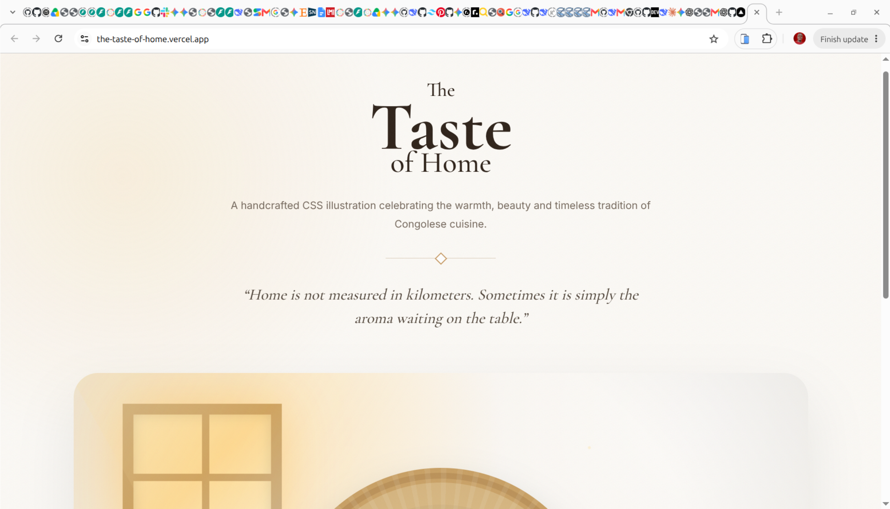
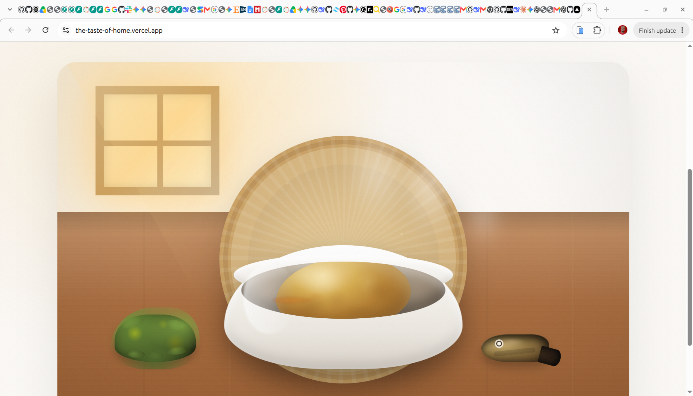

# The Taste of Home

> A handcrafted CSS artwork celebrating the warmth of Congolese cuisine.

<p align="center">
  
   
</p>

## About

**The Taste of Home** is a digital illustration built almost entirely with HTML and CSS.

The artwork recreates a warm family dining scene inspired by Congolese cuisine, featuring:

- 🍚 Freshly prepared fufu
- 🌿 Pondu (cassava leaves)
- 🐟 Smoked fish
- ♨️ Animated steam
- 🪵 A handcrafted wooden table
- 🧺 A woven raffia placemat
- 🥣 A realistic ceramic bowl

Every element is created using CSS gradients, shadows, pseudo-elements, border-radius manipulation, and carefully layered compositions.

---

## Live Demo

**https://the-taste-of-home.vercel.app/**

---

## Project Structure

```
.
├── index.html
├── css
│   ├── reset.css
│   ├── variables.css
│   ├── main.css
│   ├── scene.css
│   ├── bowl.css
│   ├── food.css
│   ├── steam.css
│   └── animations.css
├── js
└── assets
```

---

## CSS Techniques

- Multiple radial gradients
- Linear gradients
- Repeating gradients
- Pseudo-elements
- Layered box-shadows
- Custom border-radius
- CSS animations
- Transform & filter effects
- Responsive layout

---

## License

[MIT](LICENSE)

---

Made by Alphonse Kazadi.
